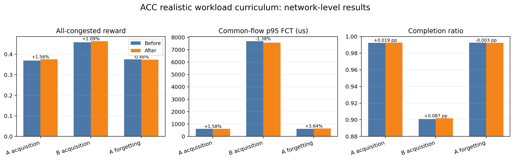
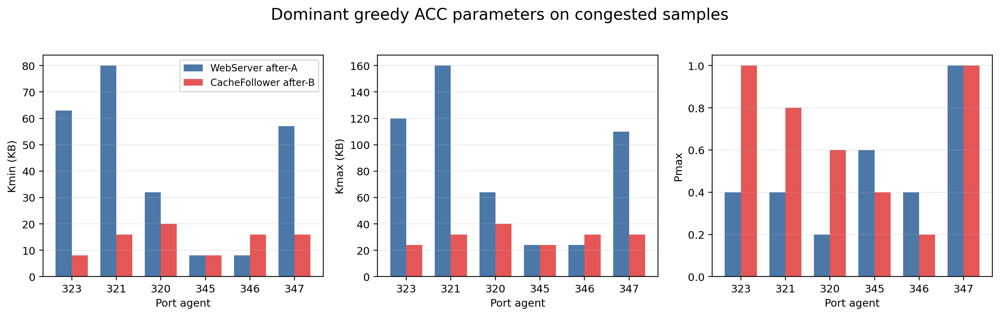
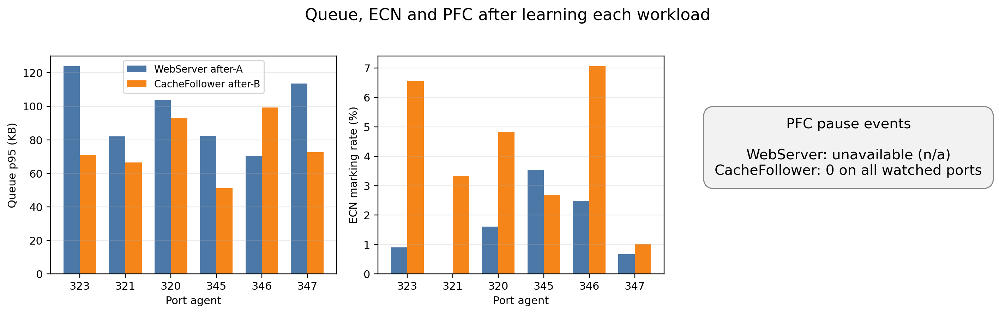
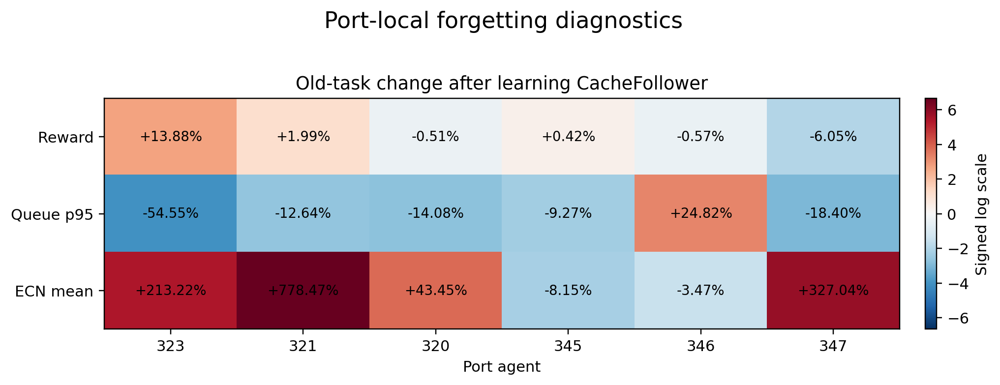
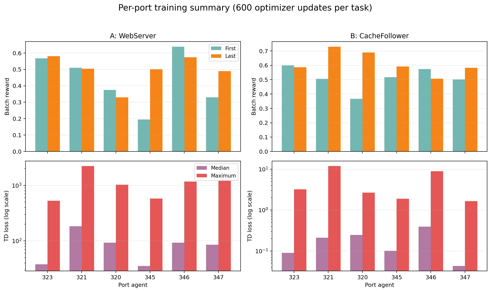

# ACC 现实流量持续学习实验汇报

## 1. 实验设置

本次实验考察关闭跨端口 global replay 后，ACC 在现实流大小分布切换中的持续
学习行为：

```text
realistic_webserver → realistic_cachefollower
```

两项任务使用相同的 256 主机拓扑、40 Gbps Agg–Core 链路、400 KB 交换机
buffer、60% offered load、泊松到达、seed 1、奖励函数及训练预算；只改变流大小
CDF。每个任务执行 600 次优化更新，冻结评估使用 greedy 策略。

| 设置 | 数值 |
|---|---:|
| ACC hidden dimensions | 32, 64, 64, 32 |
| Action space | multiscale |
| Global/shared replay | 关闭 |
| Epsilon schedule | phase-local；A→B重启探索（本报告对应旧协议） |
| Updates per task | 600 |
| Reward | tail_safe, queue lambda=5, ECN lambda=5 |
| 观测端口 | 323, 321, 320, 345, 346, 347 |

注意：本报告中的既有数据是在任务B将epsilon重新置为1.0的旧协议下获得。
后续主实验已改为global epsilon调度，A→B不重新衰减；两组结果应分别标为
“exploration restart”和“continuous exploration”，不能混为同一实验重复。

## 2. 两种现实流量模式

| 指标 | WebServer（任务 A） | CacheFollower（任务 B） |
|---|---:|---:|
| 生成流数 | 31,480 | 4,612 |
| 平均流大小 | 152.82 KB | 698.17 KB |
| 中位流大小 | 1.53 KB | 31.17 KB |
| p90 | 69.51 KB | 2.61 MB |
| p95 | 238.05 KB | 2.90 MB |
| p99 | 833.72 KB | 4.39 MB |
| 最大流 | 19.79 MB | 28.39 MB |
| 不超过 10 KB | 78.20% | 43.89% |
| 不超过 100 KB | 90.48% | 57.49% |

WebServer 由大量短流主导；CacheFollower 的平均流大小约为 WebServer 的
4.57 倍，大流和持续流占比明显更高。

## 3. 全网学习与遗忘结果

| 比较 | Common flows | Reward 前→后 | Reward变化 | p95 FCT 前→后 | p95变化 | 完成率前→后 | 完成率变化 | p99 slowdown 前→后 |
|---|---:|---:|---:|---:|---:|---:|---:|---:|
| 任务 A 习得 | 31,226 | 0.36927→0.37502 | +1.56% | 606.61→616.20 μs | +1.58% | 99.2344%→99.2535% | +0.0191 pp | 6.5769→6.5063 |
| 任务 B 习得 | 4,127 | 0.45808→0.46307 | +1.09% | 7681.90→7576.04 μs | -1.38% | 90.0911%→90.1778% | +0.0867 pp | 9.7138→9.5246 |
| 学习 B 后回测 A | 31,231 | 0.37502→0.37321 | **-0.48%** | 616.44→638.88 μs | **+3.64%** | 99.2535%→99.2503% | -0.0032 pp | 6.5061→6.5219 |



全网结果显示方向一致但幅度较轻的遗忘：学习 CacheFollower 后回到
WebServer，全部拥塞端口平均 reward 下降 0.48%，共同流 p95 FCT 恶化
3.64%（增加 22.44 μs），完成率基本不变。

## 4. 学习后的端口主导参数

下表统计 greedy 冻结评估期间拥塞样本的主导动作。

| 端口 | WebServer after-A | 主导占比 | CacheFollower after-B | 主导占比 | 参数迁移 |
|---:|---|---:|---|---:|---|
| 323 | Kmin=63, Kmax=120 KB, Pmax=0.40 | 100.00% | Kmin=8, Kmax=24 KB, Pmax=1.00 | 54.72% | 更早、更强 ECN |
| 321 | 80, 160 KB, 0.40 | 100.00% | 16, 32 KB, 0.80 | 66.04% | 更早、更强 ECN |
| 320 | 32, 64 KB, 0.20 | 100.00% | 20, 40 KB, 0.60 | 73.58% | 更早、更强 ECN |
| 345 | 8, 24 KB, 0.60 | 100.00% | 8, 24 KB, 0.40 | 58.49% | 阈值不变，标记减弱 |
| 346 | 8, 24 KB, 0.40 | 100.00% | 16, 32 KB, 0.20 | 67.92% | 更晚、更弱 ECN |
| 347 | 57, 110 KB, 1.00 | 88.68% | 16, 32 KB, 1.00 | 96.23% | 更早 ECN |
| **六端口平均** | **Kmin=41.33, Kmax=83.67 KB, Pmax=0.50** | — | **Kmin=14.00, Kmax=30.67 KB, Pmax=0.67** | — | **Kmin -66.1%，Kmax -63.3%，Pmax +33.3%** |



CacheFollower 整体选择更低的 Kmin/Kmax 和更高的 Pmax，说明大流工作负载使
策略倾向更早、更强地进行 ECN 标记。WebServer 上五个端口的主导动作占比为
100%，而 CacheFollower 上多数端口仍在多个动作间切换，表明任务 B 的策略
状态依赖更强。

## 5. 两个任务学习后的队列、ECN 与 PFC

| 端口 | WebServer Queue p95 | CacheFollower Queue p95 | WebServer ECN均值 | CacheFollower ECN均值 | CacheFollower PFC pause |
|---:|---:|---:|---:|---:|---:|
| 323 | 123.84 KB | 70.87 KB | 0.90% | 6.56% | 0 |
| 321 | 82.09 KB | 66.52 KB | 0.02% | 3.33% | 0 |
| 320 | 103.97 KB | 93.13 KB | 1.61% | 4.83% | 0 |
| 345 | 82.34 KB | 51.17 KB | 3.54% | 2.69% | 0 |
| 346 | 70.51 KB | 99.27 KB | 2.48% | 7.06% | 0 |
| 347 | 113.59 KB | 72.60 KB | 0.67% | 1.02% | 0 |
| **六端口等权平均** | **96.06 KB** | **75.59 KB** | **1.54%** | **4.25%** | **0** |



与 WebServer 相比，CacheFollower 的平均 ECN 标记率约为 2.76 倍，平均
Queue p95 下降约 21.3%。这与低阈值、高 Pmax 的动作迁移一致。CacheFollower
观测端口没有发生 PFC pause；WebServer PFC 数据为 `n/a`，不能按零处理，因而
当前不能使用 PFC 论证遗忘。

## 6. 各端口习得与遗忘

### 6.1 任务 A：WebServer 习得

| 端口 | Reward变化 | Queue p95变化 | ECN均值变化 | Reward前→后 | Queue p95前→后 |
|---:|---:|---:|---:|---:|---:|
| 323 | -5.43% | +16.35% | +68.17% | 0.5991→0.5666 | 106.44→123.84 KB |
| 321 | -2.93% | +40.53% | -93.86% | 0.5428→0.5269 | 58.41→82.09 KB |
| 320 | +3.03% | +14.20% | -28.05% | 0.4785→0.4931 | 91.05→103.97 KB |
| 345 | +9.88% | -35.11% | +205.71% | 0.5246→0.5764 | 126.89→82.34 KB |
| 346 | -1.99% | -21.71% | +606.93% | 0.6483→0.6354 | 90.06→70.51 KB |
| 347 | +2.51% | +13.25% | -64.13% | 0.5297→0.5430 | 100.30→113.59 KB |

任务 A 的端口学习结果并不一致；虽然全网 reward 提升 1.56%，但部分端口
reward 或队列恶化，且 A 阶段 TD loss 震荡明显。

### 6.2 任务 B：CacheFollower 习得

| 端口 | Reward变化 | Queue p95变化 | ECN均值变化 | Reward前→后 | Queue p95前→后 | PFC pause前→后 |
|---:|---:|---:|---:|---:|---:|---:|
| 323 | +6.20% | -43.46% | +97.64% | 0.5458→0.5796 | 125.34→70.87 KB | 0→0 |
| 321 | +29.04% | -44.44% | +246.09% | 0.5571→0.7188 | 119.74→66.52 KB | 0→0 |
| 320 | -13.87% | +12.35% | +22.21% | 0.7345→0.6326 | 82.90→93.13 KB | 0→0 |
| 345 | +6.19% | +2.04% | -24.68% | 0.5919→0.6285 | 50.15→51.17 KB | 0→0 |
| 346 | +0.50% | +19.75% | +1.96% | 0.5138→0.5163 | 82.90→99.27 KB | 0→0 |
| 347 | +3.07% | -37.77% | +177.88% | 0.5716→0.5891 | 116.67→72.60 KB | 0→0 |

### 6.3 学习 B 后回测 A：端口局部遗忘

| 端口 | Reward变化 | Queue p95变化 | ECN均值变化 | Reward前→后 | Queue p95前→后 | ECN前→后 | 判断 |
|---:|---:|---:|---:|---:|---:|---:|---|
| 323 | +13.88% | -54.55% | +213.22% | 0.5666→0.6452 | 123.84→56.29 KB | 0.0090→0.0283 | 强标记压低队列，reward改善 |
| 321 | +1.99% | -12.64% | +778.47% | 0.5269→0.5373 | 82.09→71.71 KB | 0.0002→0.0020 | ECN相对增幅受极低基线影响 |
| 320 | -0.51% | -14.08% | +43.45% | 0.4931→0.4905 | 103.97→89.34 KB | 0.0161→0.0231 | 轻微reward退化 |
| 345 | +0.42% | -9.27% | -8.15% | 0.5764→0.5789 | 82.34→74.71 KB | 0.0354→0.0325 | 稳定负对照 |
| 346 | -0.57% | +24.82% | -3.47% | 0.6354→0.6318 | 70.51→88.02 KB | 0.0248→0.0239 | 队列型局部退化 |
| 347 | **-6.05%** | -18.40% | **+327.04%** | 0.5430→0.5102 | 113.59→92.69 KB | 0.0067→0.0285 | 最强过度ECN遗忘候选 |
| **六端口等权汇总** | **平均 +1.57%，中位 -0.05%** | **平均 -14.02%** | **绝对均值约 +50.0%** | — | 96.06→78.79 KB | 0.0154→0.0231 | 局部退化被整体平均掩盖 |



热图采用有符号对数颜色以避免 ECN 相对变化掩盖 reward 和 queue，单元格文字
保留原始百分比。端口 347 同时出现 reward 下降 6.05% 和 ECN 增长 327.04%，
是最明显的过度标记候选；端口 346 的 Queue p95 恶化 24.82%；端口 345 可作为
同一网络中的稳定负对照。

## 7. 各端口训练 Reward 与 TD Loss

| 端口 | WebServer batch reward首→尾 | WebServer loss中位/最大 | CacheFollower batch reward首→尾 | CacheFollower loss中位/最大 |
|---:|---:|---:|---:|---:|
| 323 | 0.5676→0.5804 | 37.7872 / 529.5695 | 0.5990→0.5873 | 0.0902 / 3.1926 |
| 321 | 0.5101→0.5037 | 183.1698 / 2228.0843 | 0.5052→0.7295 | 0.2108 / 11.8884 |
| 320 | 0.3751→0.3302 | 92.4920 / 1027.4346 | 0.3664→0.6900 | 0.2460 / 2.6620 |
| 345 | 0.1946→0.5002 | 35.2847 / 579.6810 | 0.5167→0.5916 | 0.1012 / 1.8828 |
| 346 | 0.6380→0.5738 | 92.9263 / 1168.7947 | 0.5741→0.5065 | 0.3925 / 8.9014 |
| 347 | 0.3296→0.4895 | 85.0307 / 1205.3977 | 0.5013→0.5834 | 0.0428 / 1.6483 |
| **六端口等权平均** | **0.4358→0.4963** | **87.78 / —** | **0.5105→0.6147** | **0.1806 / —** |



WebServer 阶段存在很高的 TD-loss 尖峰和中位数，说明价值网络训练震荡明显；
CacheFollower 阶段 loss 最终收敛到较低水平。这只能证明 B 带来了适应压力及
新的价值分布，不能单独证明遗忘；遗忘仍需由冻结 A 回测确认。

## 8. 机制解释与结论边界

本次实验得到的机制链条是：

```text
WebServer 短流主导
       ↓ 切换现实流大小CDF
CacheFollower 大流比例提高
       ↓ ACC重新训练
多数观测端口转向更低Kmin/Kmax和更高Pmax
       ↓ 回到WebServer冻结评估
六端口平均ECN增加约50%，Queue p95降低约18%
       ↓
全网WebServer reward下降0.48%，共同流p95 FCT恶化3.64%
```

因此当前结果支持：

1. 两种现实工作负载确实诱导出明显不同的端口 ACC 参数；
2. 学习任务 B 后回测 A，出现方向一致但幅度较轻的全网遗忘；
3. 遗忘更可能由 CacheFollower 策略带来的过度 ECN 标记造成，而不是 PFC 或
   全网队列积压；
4. 端口 347 和 346 存在更明显的局部退化，端口 345 是可用负对照。

当前尚不能宣称：

- 出现严重、广泛的灾难性遗忘；
- PFC 是遗忘原因；
- 单 seed 结果具有统计泛化性；
- 仅凭 WebServer 与 CacheFollower 上的不同动作即可证明参数覆盖。

下一项关键诊断应在同一个 WebServer 冻结流量上比较 `after_a` 与 `after_b`
动作直方图，确认学习 B 后回测 A 时是否仍输出 CacheFollower 式的低阈值、
高 Pmax 参数。

## 9. 图表复现

```bash
python scripts/continual_validation/plot_realistic_webserver_cachefollower.py
```

该脚本只重绘本次 seed-1 已登记结果，不重新运行训练或仿真。
